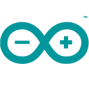

### Hello there, I'm Marco👋

I'm keen on Air navigations systems and love to bring more and more aeronautics in my GitHub! 

### Some of my work:
|||
|-|-|
|[Geodesic calculations](https://github.com/RossWorks/Geodesy) A small tool to compute distances and bearings| [Air Navigation System](https://github.com/RossWorks/PyGama) A complete air navigation suite with flight plan visualization capabilities|
|[Navigation databases](https://github.com/RossWorks/NAV-DB) A tool to generate navigation databases|[ARINC 429](https://github.com/RossWorks/ARINC429) Understand how an ARINC429 frame is made|
|[Wheather station](https://github.com/RossWorks/AutoLightHouse) Wheather data collection along with GPS clock||
|||

### I'm familiar with: 
 - Version control Systems  
 - Programming languages 
    Ada
 - Embedded technologies   RTOS
 - Standards  ARINC 424, ARINC 429, DO-178B
 - Frameworks  

### I'm currenlty learning: 
 , DO-332

<!--
**RossWorks/RossWorks** is a ✨ _special_ ✨ repository because its `README.md` (this file) appears on your GitHub profile.

Here are some ideas to get you started:

- 🔭 I’m currently working on ...
- 🌱 I’m currently learning ...
- 👯 I’m looking to collaborate on ...
- 🤔 I’m looking for help with ...
- 💬 Ask me about ...
- 📫 How to reach me: ...
- 😄 Pronouns: ...
- ⚡ Fun fact: ...
-->
